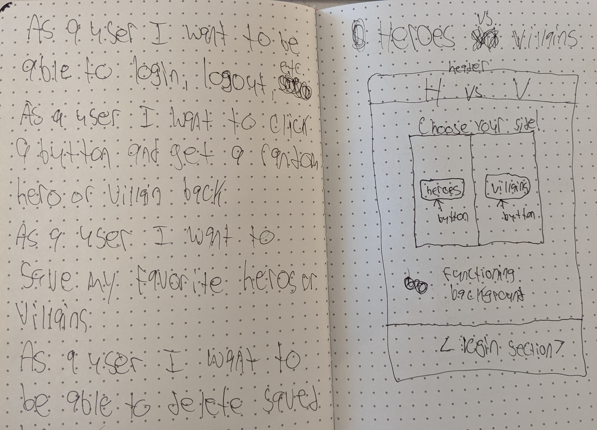
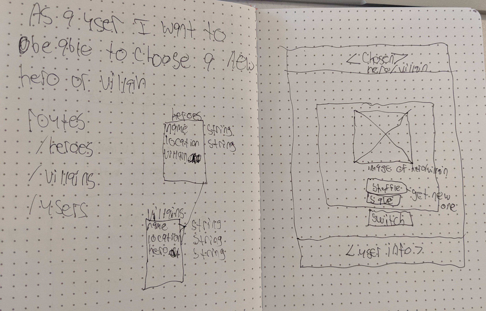

## Serve-A-Hero

* * *
## _Description_:
A SPA where you can create,read,update and destroy resources(heroes and villains) from a database on my own [api](https://github.com/cclancy97/FullStack)
Once logged in, you can enter your hero/villain details in the forms and it will display on the screen
***
## _Wireframes/User-Stories/ERD_:

## 

## 

* * *
## _Technologies used_:
  - jQuery
  - HTML
  - Bootstrap
* * *

## _Future Versions_:
I would like to add the option for a user to upload an image for their hero to be displayed
***

## _Planning_:
- Built resource table and tested w/curl scripts
- Connected frontend to backend
- Added authentication
- Added requests to api from the frontend
- Styled
